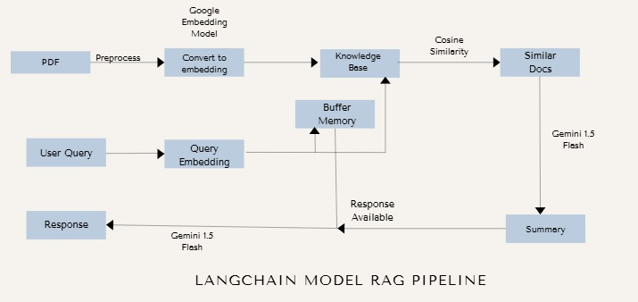

#  MediBot Backend

This is the Flask backend for **MediBot**, a RAG (Retrieval-Augmented Generation) based healthcare chatbot that leverages powerful LLMs and vector search to deliver contextual, accurate responses from medical PDFs and documents.

##  Tech Stack

- **Flask** – Python-based backend framework
- **LangChain** – RAG pipeline orchestration
- **Gemini 1.5 Flash** – For generating answers
- **Gemini Embeddings** – For converting text to embeddings
- **ChromaDB** – Vector database to store and query document embeddings
- **Cosine Similarity** – To retrieve relevant chunks with a similarity threshold of 0.7
- **Buffer Memory** – Context persistence across user chats for coherent, multi-turn conversations

---

##  RAG Workflow

1. **PDF Upload**: Medical documents (PDFs) are uploaded and processed.
2. **Chunking & Embedding**:
   - PDFs are split into chunks of **5000 tokens**.
   - Each chunk overlaps **500 tokens** from the previous chunk to retain contextual continuity.
   - Chunks are converted into vector embeddings using **Gemini Embeddings**.
3. **Vector Storage**: All embeddings are stored in **ChromaDB**.
4. **Query Handling**:
   - User queries are embedded and compared to stored vectors using **cosine similarity**.
   - Chunks with a similarity score **≥ 0.7** are fetched.
5. **Contextual Response Generation**:
   - Relevant chunks are passed to **Gemini 1.5 Flash** via **LangChain** to generate a response.
   - **Buffer memory** maintains conversational context for each user session.

---

##  Architecture




##  Running Locally

### Prerequisites

- Python 3.10+
- pip
- Virtual environment (recommended)

### Setup

```bash
git clone https://github.com/yourusername/mediBotBackend.git
cd mediBotBackend
python -m venv venv
source venv/bin/activate  # On Windows: venv\Scripts\activate
pip install -r requirements.txt
flask run
